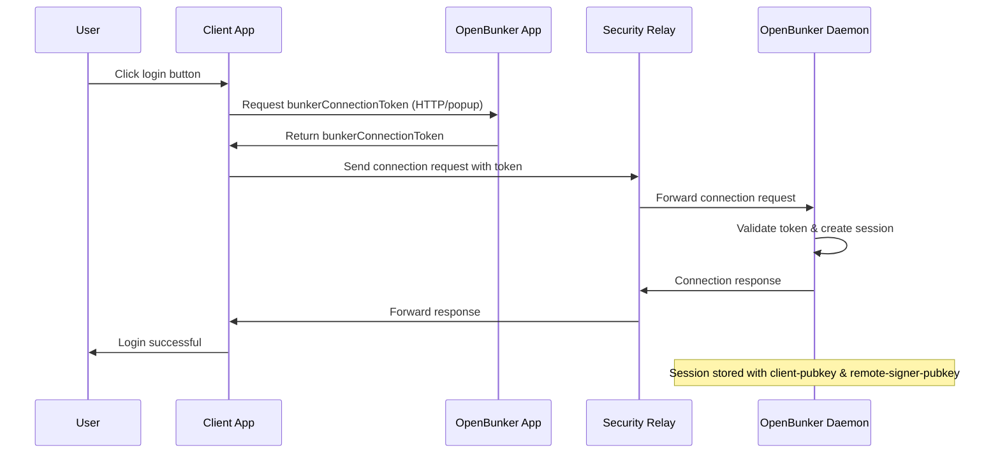
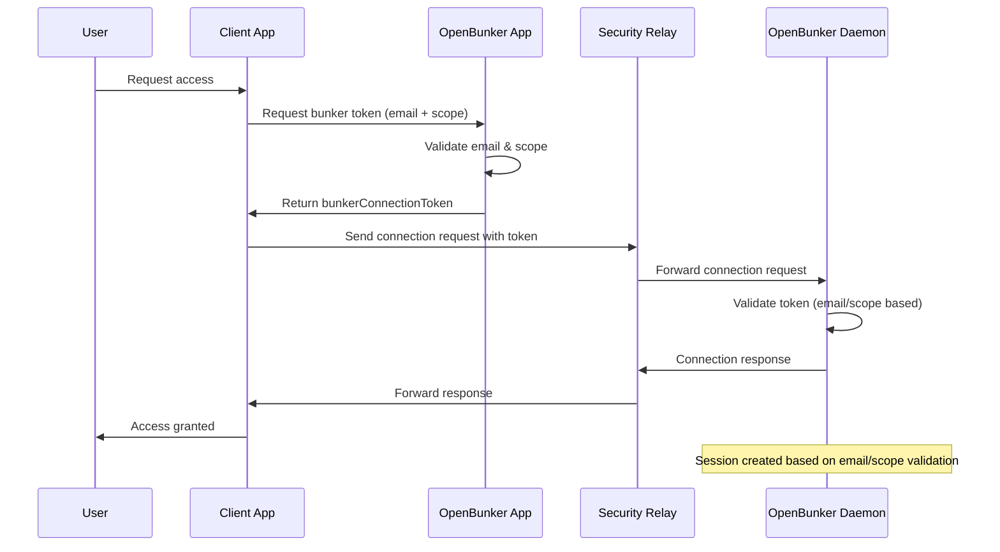
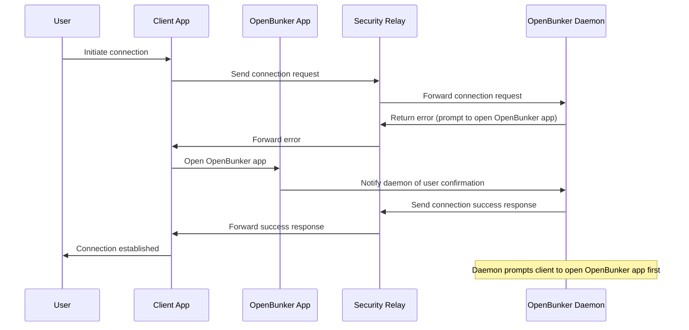

# Terminology

- OB == Openbunker

## [NIP-46](https://github.com/nostr-protocol/nips/blob/master/46.md) terminology :

- user: A person that is trying to use Nostr.
- client: A user-facing application that user is looking at and clicking buttons in. This application will send requests to remote-signer.
- remote-signer: A daemon or server running somewhere that will answer requests from client, also known as "bunker".
- client-keypair/pubkey: The keys generated by client. Used to encrypt content and communicate with remote-signer.
- remote-signer-keypair/pubkey: The keys used by remote-signer to encrypt content and communicate with client. This keypair MAY be same as user-keypair, but not necessarily.
- user-keypair/pubkey: The actual keys representing user (that will be used to sign events in response to sign_event requests, for example). The remote-signer generally has control over these keys.

- bunker connection tokens : `bunker://{remote-signer-pubkey}?relays={relay}&secret={secret}

## Openbunker concepts

- scope : Scope in which OpenBunker will store at most one key-pair per email address
- identity : this is a key, associated with email address and scope
- Users (interacting via apps that generate a nsec for their session)
- Accounts : this is essentially the different login methods for a user, for now Discord and email

OpenBunker fits into NIP-46 by implementing the NIP-46 remote signer, and letting users create connections via bunker connection tokens created by OpenBunker.

Openbunker makes the link between social accounts and email, and NOSTR keys referred to here as identities. Openbunker creates and manages identities automatically within a certain `scope`. We can imagine that a single community will have its own scope, and that additional controls to expand or manage the community's scope will be introduced in Openbunker. For now a scope is simply denoted as a unique slug string that are passed along requests for new identities.

### Components

- OpenBunker app : a Next.js application
- OpenBunker daemon : a daemon that listens to a relay for NIP-46 requests

## Flows

OpenBunker will support 3 authentication flows

### Explicit Connection flow

This flow involves the user clicking on an openbunker login button, selecting an identity and waiting for the client signer to complete connection

client talks to the OpenBunker app via HTTP or a popup and gets a bunkerConnectionToken.

client then sends connection request over a security relay, and the OpenBunker daemon responds via this channel. Openbunker keeps track of sessions using the `client-pubkey` and `remote-signer-pubkey`. Subsequent requests are approved based on the existence of a session.

### Unauthenticated connection flow (deprecated)

the user asks for a bunker token based on their email address for this scope. Same as Authenticated except that the flow is not authenticated but still succeeds based on email / scope

### AuthUrl flow

See NIPS-46 for this one; the bunker returns a url that the client application can use to confirm connection.

Not yet implemented.

